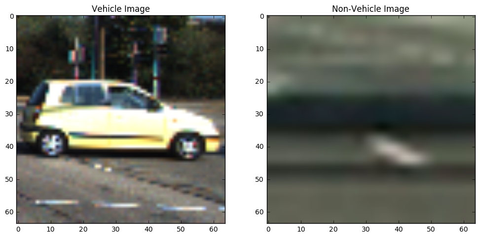
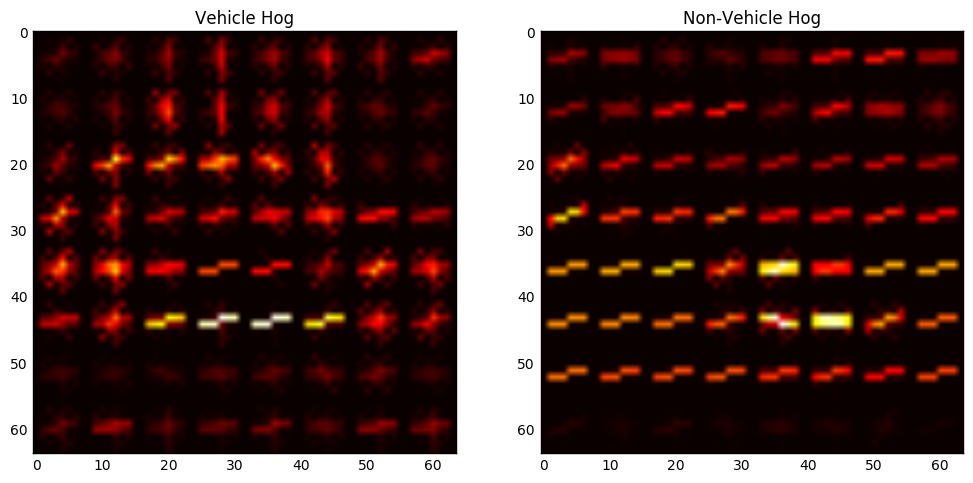
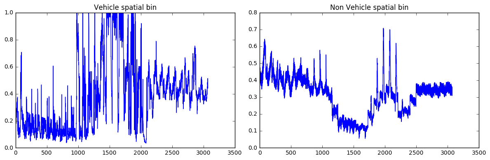
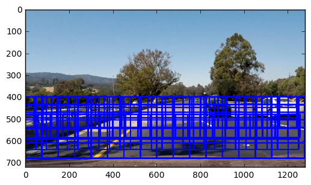
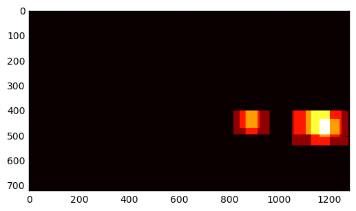
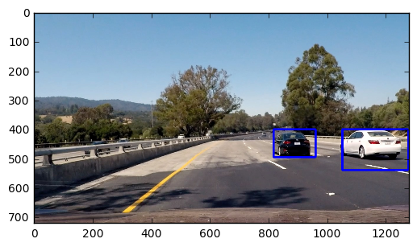

# Vehicle Detection using Classical Computer Vision Techniques

The goals / steps of this project are the following:

- Demonstrate the benefits of Histogram of color as a feature in vehicle detection.
- Demonstrate the benefits of Spacial Bins as a feature in vehicle detection.
- Demonstrate the benefits of HOG-Histogram of Oriented Gradients as a feature in vehicle detection.
- Visualize the benifits of normalization
- Perform a Histogram of Oriented Gradients (HOG) feature extraction on a labeled training set of images and train a classifier - Linear SVM classifier
- Optionally, you can also apply a color transform and append binned color features, as well as histograms of color, to your HOG feature vector.
- Implement a sliding-window technique and use your trained classifier to search for vehicles in images.
- Run your pipeline on a video stream (start with the test_video.mp4 and later implement on full project_video.mp4) and create a heat map of recurring detections frame by frame to reject outliers and follow detected vehicles.
- Estimate a bounding box for vehicles detected. Soure(2)

# Introduction

The main three steps cycle in robotics are perception, decision making and action. It can be said that the most important step in building autonomous vehicles is perception. Computer vision is the art and science of perceiving the world through images. In autonomous vehicles, computer vision can help us detect lane markings, pedestrians, other vehicles and can give us the understanding about the environment in order to navigate safely. In this project we focus on detecting the vehicles arounfd an autonomous car, using images captured. This time, we opted to use classical computer vision techniques to detect vehicles. These techniques were HOG-Histogram of Oriented Gradients, Spatial Bins and Histogram of color. 

## Example of Vehicle and Non-Veehicle Images

#### I tried different color spaces(HLS, LUV and YCrCb), YCrCb performed better in term of accuracy using Linear SVM. So, for extracting feature I will be showing my work using YCrCb.

For HOG, I tried different parameter values. At the end I am using these values.
- orientations: 9
- pixels per cell: 8
- cells per block :2
- channels : ALL

#### For spatial binning dimensions used are 32x32 and color space is 'YCrCb'

## Training the Linear SVM Classifier
#### Function extract_features defined in the code is used here to claculate and normalize spatial, histogram and HOG feautres

- Using: 9 orientations 8 pixels per cell and 2 cells per block
- Feature vector length: 8460
- 6.53 Seconds to train SVC...
- Test Accuracy of SVC =  0.991

## Sliding Window Search

The next important step was to make a strategy to extract patches from an image to check if these represent a vehicle or not. 
- After spending a lot of time experimenting, multi scale windows are used to extract patches. The main reason is that car appears in different sizes dependent on how far these are. Some cars are bigger in some frames and others are small. That is the reason this multisclae approach is used. 
- Also, different focus areas are used for different window sizes.
- Overlapping is kept to 0.5, experimented with higher overlaps like 0.8,0.9 which resulted in a lot of windows but not a lot of benefit as it increased the processing time a lot. 
- Along x-axis, whole width is used as car can be in different lanes so it is important that it is considering the right most lane or left most lane etc. 
    - Window Size: (80,70)       Image Area: (400,540)    Overlap: 0.5  ---> Total Images: 93
    - Window Size: (96,96)       Image Area: (400,656)    Overlap: 0.5  ---> Total Images: 100
    - Window Size: (115,105)     Image Area: (480,595)    Overlap: 0.5  ---> Total Images: 21
    - Window Size: (150,140)     Image Area: (400,680)    Overlap: 0.5  ---> Total Images: 48
    - Total Number of windows : 93+100+21+48 = 262
    

### Finding the cars
- Heatmap functionality was added in my_search_windows(), second last line
- For an individual image, thesholding is not used
- For videos find_cars() is used, performance is optimized by storing heatmpas of last 20 frames in a queue(global variable)
- After adding heatmaps all the frames, a threshold of 5 is used to filter flase positives
- Results of testing it on image and videos are shared below. 

## Final Thoughts
- There is room for improvement, for example:
    - Bounding boxes are bigger then the cars, I think there should be tight bounding for the boxes. Currently it will result in wrong understanding of car position.
    - I feel that white car is less detected by the classifier as compared to black car. In future I will do more data exploration, in this direction
    - Results might not be good in different lighting conditions for example at night. A different strategy should be used for that. For example, using the car lights at the back or side to detect vehicles. 
    - Vertically, a horizon is specified so if a car is climbing a hill, some cars might not be detected properly. 
